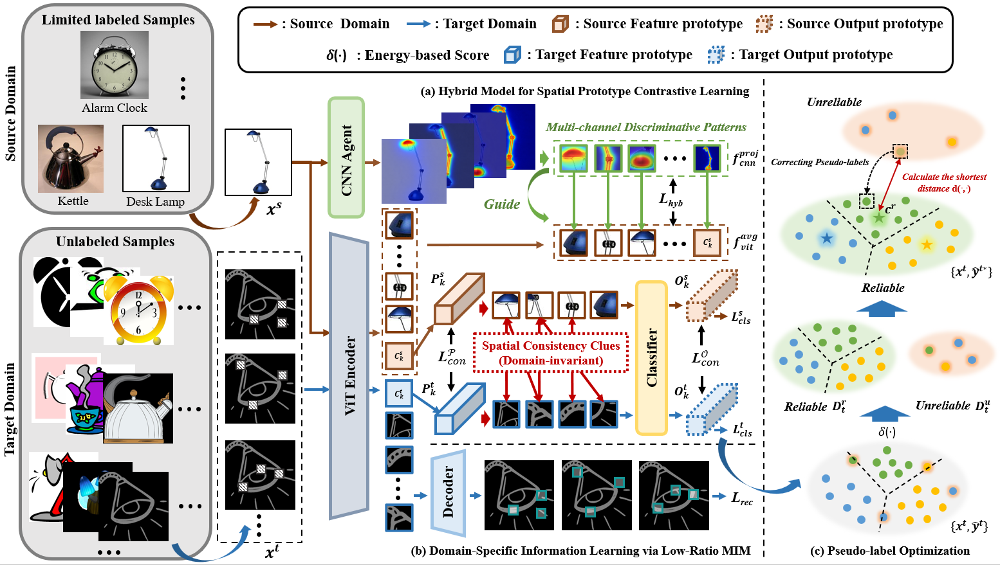

# MIM-SPCL

<div align="center">

<h3>
Masked Image Modeling Advanced Spatial Prototype Contrastive Learning 
for Limited-Source Domain Adaptation
</h3>


<p align="center">

<a href="">

</a>

<a href="">

</a>

<a href="">

</a>

<a href="">

</a>

</p>


<p align="center">
🚀 Official implementation will be released soon.
</p>


</div>


---

## 🌟 Overview

Limited-source domain adaptation (LSDA) aims to transfer knowledge from a limited labeled source domain to an unlabeled target domain under domain shift.

In this work, we propose **MIM-SPCL**, a novel framework that explores spatial discriminative patterns from limited labeled samples and integrates domain-invariant and domain-specific information for effective cross-domain knowledge transfer.


The proposed framework consists of three key components:

- 🧩 **Spatial Prototype Contrastive Learning (SPCL)**

  Explores cross-domain consistent spatial discriminative patterns by leveraging a hybrid CNN-ViT architecture.


- 🖼️ **Low-Ratio Masked Image Modeling (LR-MIM)**

  Learns target-domain-specific information from unlabeled data through lightweight reconstruction.


- 🎯 **Pseudo-Label Optimization**

  Refines pseudo-labels to provide reliable supervision for target-domain adaptation.


---

## 🔥 News

- 🚀 **[Coming Soon]** The source code and pretrained models will be publicly available.


---

## 🏗️ Method Overview


<p align="center">

</p>


The proposed MIM-SPCL framework contains three main modules:

1. **Hybrid Model for Spatial Prototype Contrastive Learning**

2. **Domain-Specific Information Learning via Low-Ratio MIM**

3. **Pseudo-Label Optimization**


---

## 📊 Benchmark Datasets


We evaluate MIM-SPCL on both natural and remote sensing scene benchmarks.


### 🌎 Natural Scene

- Office-Home


### 🛰️ Remote Sensing Scene

- AID
- NWPU
- UCM


---

## ⚙️ Installation


The implementation is based on PyTorch.

Installation instructions will be provided after code release.


```bash
conda create -n mimspcl python=3.9
conda activate mimspcl
